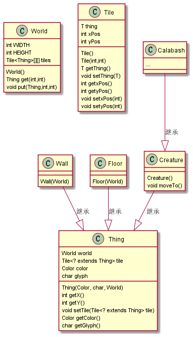
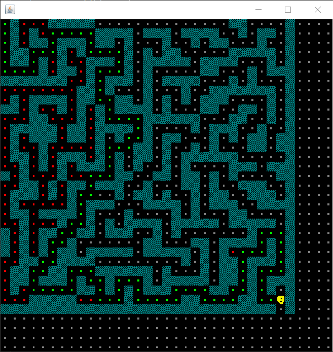

# W04

姓名：梁安泽

学号：191220055

[TOC]

### task1

###### 关于`Tile`类型

为了方便理解类之间的关系，作以下uml图：



Tile意为地砖。在gourds分支中，地砖`Tile`和墙`wall`、生物`Creature`等基本元素类型，共同构成world类型，即“世界”是由各种基础元素构成。同时，`World`类型中存放元素的数组`tiles`也是`Tile`类型，即“世界”中的各种元素都是放置在地砖之上，`Tile`类型中的`setThing()`、`getThing()`也从侧面反应了这一设计。

###### 关于`Thing`类型中的`Tile<? extends Thing> tile`属性

观察代码，发现在`Thing`类型中出现了方法`getX()`以及`getY()`，但是`Thing`类型并没有对应的坐标属性。观察`getX()`中的代码：

```java
    public int getX() {
        return this.tile.getxPos();
    }
```

`getX()`方法调用的是tile指向的`Tile`类型中的方法。

因此，`tile`属性相当于是建立起`Thing`类型与`Tile`类型之间的联系，使得`Thing`类型拥有了坐标的属性和方法。

`Thing()`作为物体，放置在`Tile`之上。从物体所处的地砖处获取位置信息，这便是其中的设计思路。

###### 关于排序

`Sorter`接口使用了多态`<T extends Comparable<T>>`，即实例化它的类型应当继承了`Comparable<T>`类型。因为例示代码需要排序的是葫芦娃，故观察`Calabash`的实现：

```java
public class Calabash extends Creature implements Comparable<Calabash> {...}
```

葫芦娃类型继承了`Comparable`类型，因此可以作为参数实例化`Sorter`。

同时，葫芦娃类型当中重载了`compareTo`方法，使得两个葫芦娃之间可以进行比较，这在`BubbleSorter`中体现了出来：

```java
@Override
    public void sort() {
        ...
        while (!sorted) {
			...
            for (int i = 0; i < a.length - 1; i++) {
                if (a[i].compareTo(a[i + 1]) > 0) {		//利用了compareTo方法
                    ...
                }
            }
        }
    }
```


### task2

我的coding做了：

* 修改部分原有框架代码，使得某些类可以被外部调用(即修改默认的package friendly)

* 修改部分迷宫生成算法，使得其可以生成：以左上角为起点，以右下角为终点的迷宫

  ```java
  public void generateMaze() {
          while(true){
              stack.push(new Node(0,0));
              while (!stack.empty()) {
                  ...		//生成迷宫     
                  }
              }
              if(maze[dimension-1][dimension-1] == 1){ //生成符合要求的迷宫
                  break;
              }
              else{ //迷宫不符合要求，重新生成
                  clearMaze();
                  stack.clear();
              }
          }
          
      }
  ```

* 在地图中增加最外围的围墙（不然边界区分不明显）

* 使用深度优先遍历算法，寻找到达终点的路径

* 在遍历寻路过程中，添加颜色标记：将有效路径标记为绿色，无效路径标记为红色

例示执行结果：



